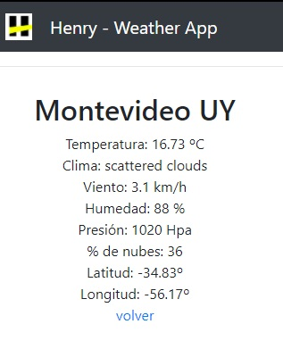

# weatherApp
React Routing Weather App
API: [openweather](https://openweathermap.org)
This is a student project we made as part of our education at [Soy Henry](https://www.soyhenry.com/), which consisted of creating a React application.

# How to start the project:

npm start in app folder

# Previews

### Home page:

### City Detail Page:

